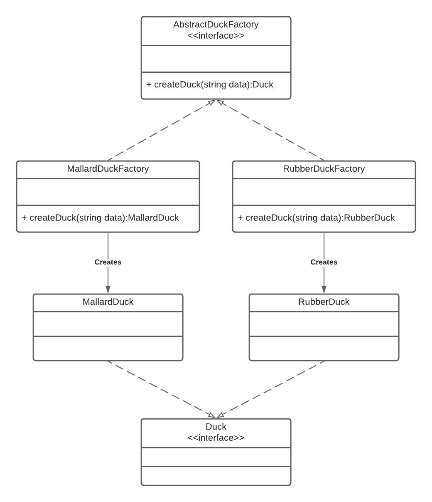
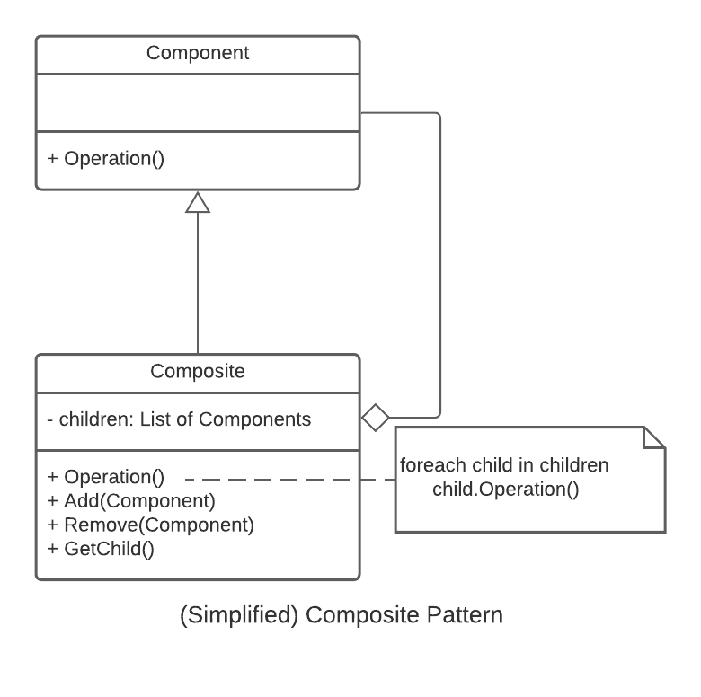
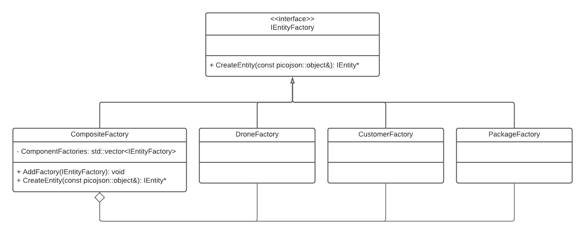

# Lab 12 Composite Factory Lab

### Introduction

This lab will introduce you to two design patterns that are used frequently in software design: The factory pattern and the composite pattern.

### The Factory Pattern

The factory pattern defines an interface for creating an object, but lets the subclasses decide which class to instantiate. Factory method lets a class defer instantiation to subclasses. Utilizing the factory pattern allows you, the developer, to enforce SOLID principles.

There are two types of factories that you can create: An abstract factory or a concrete factory. 

#### Generic Concrete Factory UML

Below is the UML to create concrete factories. This pattern should be used when the number of items to generate will rarely change in your software development. For example, in our simulation if we were only going to generate drones, packages, and customers then the concrete factory should be used. Since we are not limiting ourselves to these entities, the concrete factory should not be used.

#### Generic Abstract Factory UML

Below is the UML to create an abstract factories. This pattern should be used when you want to push the creation of objects into the subclasses. Adding an intermediary class between the factory and your program allows you to utilize polymorphism as shown during lecture and also on the lecture slides.

  

### The Composite Pattern

The composite pattern allows us to treat a group of objects as a single object. Additionally, it allows us to organize those objects as a hierarchy. 

In the composite pattern Component objects will be added to a Composite object (which implemenents the Component interface).

This can be helpful when there are operations that we want to perform on a group of the same type of objects. We would only need to perform the operation on the composite object for the same result as performing that operation on all the composed Component objects. 

  

More information on the composite pattern can be found here: https://www.dofactory.com/net/composite-design-pattern

### Implementing the Composite Factory

For our project, we want to create a composite factory which draws from both the composite and factory patterns. This means that we will have a composite factory which contains different component factories. 

  

Based on the UML, we can see that we will need to be able to add the new types of factories to the Composite factory and then use those added factories to create the entities. 

#### AddFactory
This should add the correct component (i.e. entity) factory to a list of factories(use std::vector) that the Composite factory holds. Consider where this function should be called in your code based on where you need the factories. 

#### Overloading the CreateEntity function
The CreateEntity function will need to be overridden as the CreateEntity function of the base IEntityFactory class is a pure virtual function. The function should loop through each of the factories until the correct factory successfully creates and returns a new Entity based on the parameters. If this process is not clear, refer to the image and link above in the composite pattern section of this document for hints.  

Notice that this CreateEntity function solves our problem of needing to add an 'if' statement to determine which factory needs to be called based on the type of entity as described in the lecture over the Composite Factory Pattern. We just need to call the composite factory's CreateEntity function once. 
